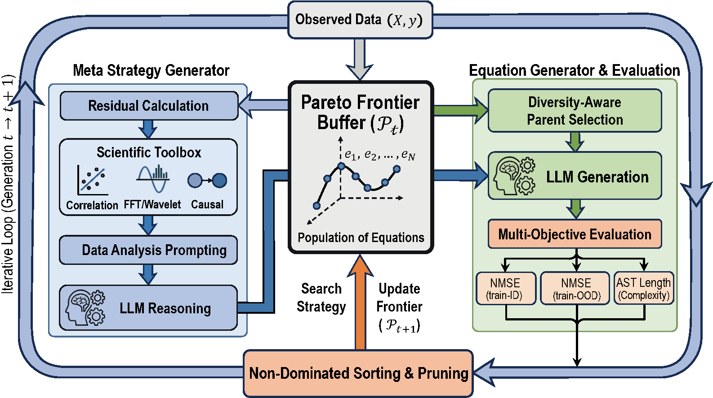

# MOT-SR

Initial code release for the paper **“MOT-SR: Multi-Objective Tool-Augmented Symbolic Regression via LLMs”**.

Main Figure:

This repository contains an initial research version of MOT-SR. It is provided for reference and early use, and may still be cleaned up or updated.

## Minimal Usage

- Environment: see [requirements.txt](./requirements.txt) or [environment.yml](./environment.yml)
- Main entry: [main.py](./main.py)
- Example script: [run_motsr.sh](./run_motsr.sh)

## Note

This release is intended to accompany the paper and share the core codebase. Some scripts, configs, and outputs are kept minimal on purpose.
